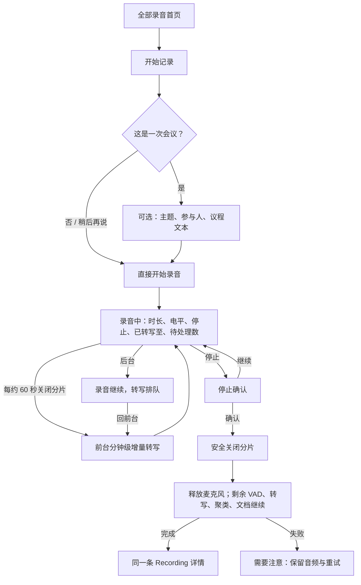
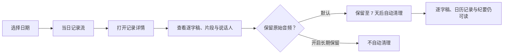
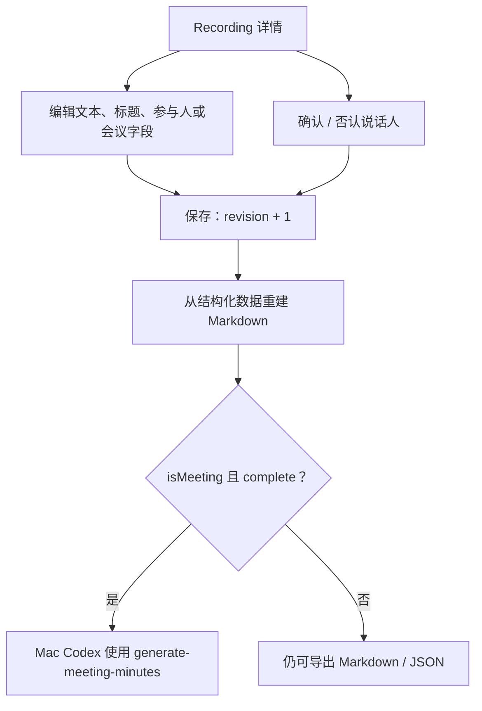

# VoiceContext v1 用户流程

> PM `#39` 交付物 · 版本 0.3 · 2026-08-07

## 1. 统一开始与完成流程

- 用户不必填写任何字段才能开始；标题、参与人、标签及会议字段都可以在后续补充。
- `isMeeting=true` 时增加会议主题、参与人和议程文本。议程不接受文件附件，v1 只保存用户输入的文本。
- 同一 Recording 的处理、错误、导出、修订和保留规则不会因会议标记而改变。
- 内部 60 秒 AudioChunk 不作为用户可见片段；录音中已关闭分片立即处理，普通分片边界处未结束的语音通过 carry 与下一连续分片重组。
- 用户停止后只等待最后音频分片安全关闭，不等待转写完成；旧 Recording 处理期间仍可开始新的 Recording。

## 2. 日历浏览与长期保留

较长静音形成片段，帮助阅读和定位，但不拆成新的录音会话。自动清理只删除设备上的原始音频与引用；删除前必须说明文档不会被删除。会议标记不自动改变保留期限。

## 3. 录音安全与异常

| 场景 | 用户看到的事实 | 下一步 |
|---|---|---|
| 后台返回 | “录音继续，转写待前台处理 · N 项” | 回前台自动按时间补转写；停止入口持续存在 |
| 系统中断 | 中断时间、gap 和路由变化 | 等待恢复或停止；不伪装连续录音 |
| 低存储 | “空间不足，无法安全开始新记录” | 打开存储清理；不静默删除音频 |
| 转写失败 | “转写未完成，音频已保存” | 重试、查看影响；不以空文本完成 |
| iCloud 不可用 / 冲突 | “文档仍保存在本机” / “已保留双方副本” | 继续本地使用、导出或处理冲突 |
| 试用耗尽 | “音频已保存，转写等待解锁” | 购买、恢复购买或稍后重试 |

## 4. 修订、说话人与会议纪要

`unknown`、`suspected` 与 `confirmed` 的语义不变。只有用户确认后才更新长期声纹档案；Skill 永不覆盖原始 Markdown 或 JSON，也不会把 suspected 当成 confirmed。

在对话内为当前说话人“新建客户档案”代表用户对这一身份和当前声纹的显式确认：保存时创建新的长期声纹身份，关联全局客户档案，并供后续录音匹配。若当前只是 suspected 命中旧身份，“新建”也不得覆盖或重命名旧档案；只有“选择已有客户”路径才复用已有身份。该行为沿用已确认的原生表单和安静工具风格，无需新原型。
